# Action Tiles Component
## Getting Started with Action Tiles

To use an **Action Tile Controller** in your mobile application include the `ActionComponents.dll` and reference the following using statement in your C# code:

```csharp
using ActionComponents;
```

## Adding a Action Tile Controller to your Mobile App

**Action Tiles** were designed to make adding it to your mobile application in Xamarin Studio easy.

### For iOS

Add a `UIView` to your project in the `main.storyboard` file using Xcode then switch it’s type to `ACTileController`. The **Tile Controller** can either fill the app's view or take up a portion.

### For Android

Open your `Main.axml` file in Visual Studio, insert a `View` into it, switch its **Class** to `ActionComponents.ACTileController` in the **Source** view. As with iOS above, the **Tile Controller** can either fill the app's view or take up a portion.


### Created from Code

You also have the option of creating your **Action Tile Controller** completely in C# code for either iOS or Android. 

## Adding Groups to the Controller

With the **Action Tile Controller** added to the app User Interface, you can use the following code to add one or more Tile Groups. For example,:

```csharp
// Add new group
var scenes = tileController.AddGroup(ACTileGroupType.ExpandingGroup, "Favorite Scenes", "Add your favorite scenes here");
```

## Adding Tiles to Groups

With a **Tile Group** created, you can now insert one or more Tile into the group. For example, in iOS:

```csharp
// Add tile to group
group1.AddTile(ACTileStyle.DescriptionBlock, ACTileSize.Quad, "Message", "Welcome!", "We hope that you are enjoying your ActionTile View. Look around and see what all I can do!", "OpenMail");
```

For the last property you can pass either a `UIImage` or specify the name of an image added as an **Image Assets** to the app's project. Here is an example for Android:

```csharp
// Add tile to group
accessories.AddTile(ACTileStyle.Accessory, ACTileSize.Quad, "Kitchen Eve Door", "No Response", "", Resources, Resource.Drawable.House);
```

For Android, pass the current Resources and specify the ID of an image added t the project's `Resources/Drawable` directory.

When adding or modifying a large number of Tiles, you should suspend updating on the Action Tile Controller and re-enable it after completion. For example:

```csharp
// Stop the tile controller from updating while we populate it
tileController.suspendUpdates = true;

// Add new groups and tiles
...

// Allow update and automatically refresh the screen
tileController.suspendUpdates = false;
```

## Controlling Appearance and Functionality

**Action Tiles** provide several different methods to easily adjust their look, feel and behavior. Using the `Appearance` properties of the **Tiles**, **Tile Groups** and the **Tile Controller** you has full control or the look and feel:

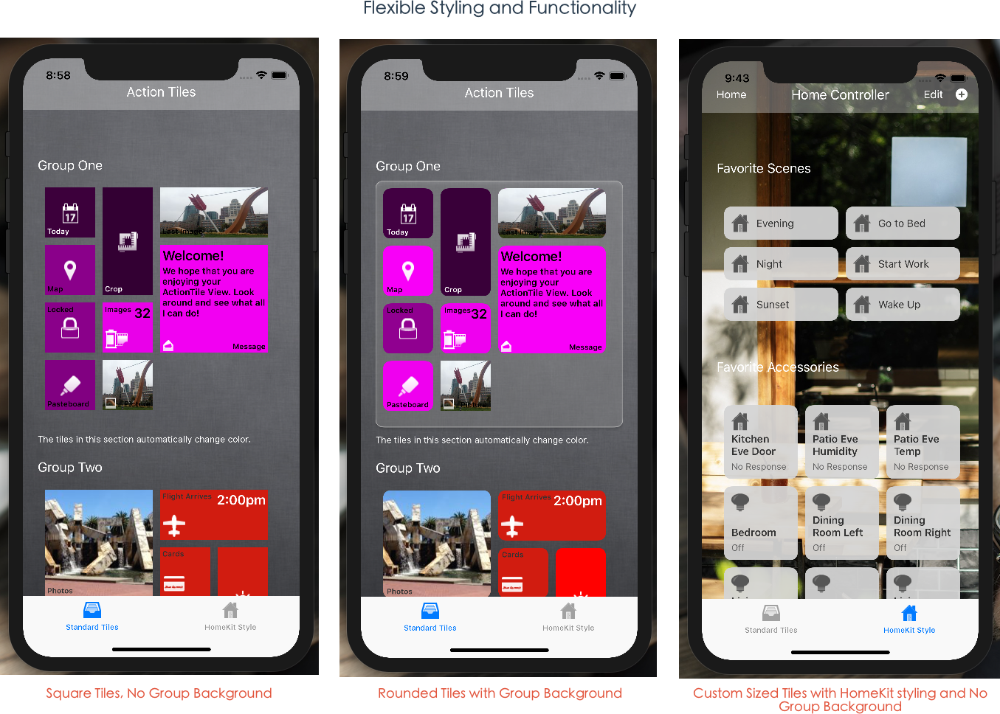

For example, setting the **Tile Controllers** background image and the default **Tile** and **Tile Group** appearances:

```csharp
// Setup tile controller
tileController.title = "Action Tiles";
tileController.scrollDirection = ACTileControllerScrollDirection.Vertical;
tileController.appearance.backgroundImage = UIImage.FromBundle("Linen.jpg");
tileController.navigationBar.ShowNavigationBar(true);

// Set default group appearances
tileController.groupAppearance.roundTopLeftCorner = false;
tileController.groupAppearance.roundTopRightCorner = false;
tileController.groupAppearance.roundBottomLeftCorner = false;
tileController.groupAppearance.roundBottomRightCorner = false;

// Set default tile appearances
tileController.tileAppearance.roundTopLeftCorner = false;
tileController.tileAppearance.roundTopRightCorner = false;
tileController.tileAppearance.roundBottomLeftCorner = false;
tileController.tileAppearance.roundBottomRightCorner = false;
```

## Controlling Tile Sizes

Tile sizes are specified in **Cells**. A `cell` is the unit of measure with the "virtual layout grid" that `ACTile` are laid out in. For example, here is how a **Custom Tile Size** is defined:

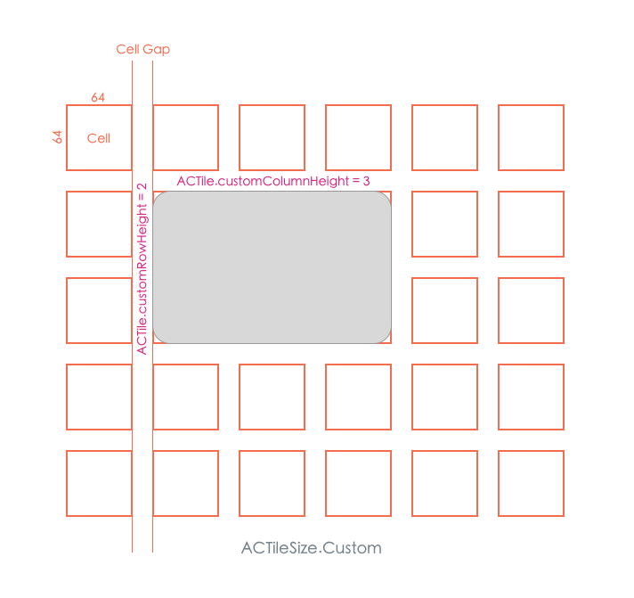

Which would be represented in code as:

```csharp
// Adjust based on device
var sceneSize = 4;
if (iOSDevice.isPhone)
{
	tileController.appearance.cellSize = 45f;
	sceneSize = 3;
}
else
{
	tileController.appearance.cellSize = 50f;
}

// Style tiles
tileController.tileAppearance.titleSize = 14f;
tileController.tileAppearance.subtitleColor = ACColor.FromRGB(100, 100, 100);
tileController.tileAppearance.subtitleSize = 12f;

// Add new group
var scenes = tileController.AddGroup(ACTileGroupType.ExpandingGroup, "Favorite Scenes", "");

scenes.AddCustomSizedTile(1, sceneSize, ACTileStyle.Scene, "Evening", "", "", "Home");
```

## Setting Scroll Direction

In code, you can control the user's scroll direction and the Action Tile Controller will automatically scroll the tiles to fit the given direction:

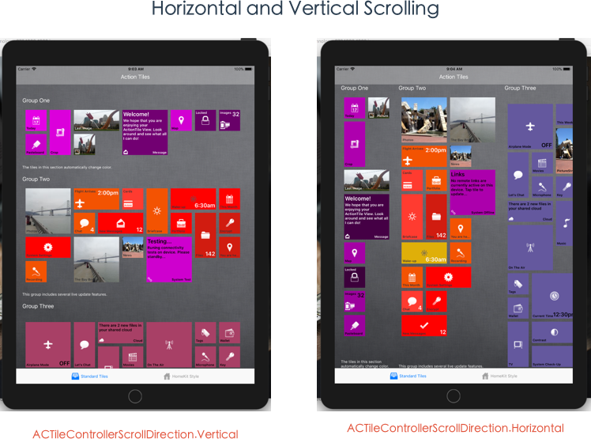

## Working with the Navigation Bar

The **Tile Controller** include a built-in **Navigation Bar** that you can optionally display. The **Navigation Bar** can include a **Title** and an optional set of buttons (`UIButton` in iOS and `Button` in Android) to provide extra functionality:

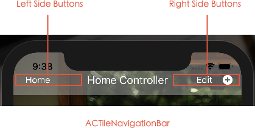

Which would look like the following in code:

```csharp
// Setup tile controller
tileController.title = "Home Controller";
tileController.scrollDirection = ACTileControllerScrollDirection.Vertical;
tileController.appearance.backgroundImage = UIImage.FromBundle("Agreement.jpg");
tileController.navigationBar.ShowNavigationBar(true);
tileController.navigationBar.AddLeftButton("Home", null, 50, 32, (sender, e) => {
	Console.WriteLine("Home button pressed");
});
tileController.navigationBar.AddRightButton("Edit", null, 50, 32, (sender, e) => {
	Console.WriteLine("Edit button pressed");
});
tileController.navigationBar.AddRightButton("", UIImage.FromBundle("Add"), 16, 16, (sender, e) => {
	Console.WriteLine("Add button pressed");
});
```

## Responding to User Interaction

You have the option of responding to `TileTouched` events for an individual **Tile**, a **Tile Group** or the **Tile Controller**. Additionally, you can use any combination of the above interactions. For example, responding to all **Tiles** in a **Tile Group**:

```csharp
// Wire-up accessories events
accessories.TileTouched += (group, tile) => {
    switch (tile.subtitle)
    {
        case "Off":
            tile.subtitle = "On";
            if (tile.title == "Bedroom")
            {
                // Simulate a light color
                tile.ChromaKeyTile(ACColor.Purple, 50, 250);
            }
            else
            {
                // Just set to white
                tile.appearance.background = ACColor.White;
            }
            tile.icon = UIImage.FromResources(Resources, Resource.Drawable.LightOn);
            break;
        case "On":
            tile.subtitle = "Off";
            tile.appearance.background = ACColor.FromRGBA(213, 213, 213, 240);
            tile.icon = UIImage.FromResources(Resources, Resource.Drawable.LightOff);
            break;
    }
};
```

Verses responding to touch events in the **Tile Controller**:

```csharp
// Display touched tile
tileController.TileTouched += (group, tile) => {
    Console.WriteLine("Touched tile {0} in group {1}", tile.title, group.title);
};
```

## Adding Live Updates

The **Action Tile Controller** provides a built-it **Live Update** system where you can specify that a given **Tile** or **Tile Group** automatically updates its content or appearance based on a specified time interval. For example, randomly picking a different hue of a base color:

```csharp
// Assign a live update action to this group
group1.liveUpdateAction = new ACTileLiveUpdateGroupChromaKey(group1, ACColor.Purple, 50, 250);
```

Selecting the color from a list of available choices:

```csharp
// Select from a list of colors
group3.liveUpdateAction = new ACTileLiveUpdateGroupColor(group3, new ACColor[] {
	ACColor.ActionBrickRed,
	ACColor.ActionCyan,
	ACColor.ActionDustyRose,
	ACColor.ActionGrape,
	ACColor.ActionGreenTea,
	ACColor.ActionLavendar,
	ACColor.ActionNavyBlue,
	ACColor.ActionOrange,
	ACColor.ActionPink,
	ACColor.ActionPinkGrapefruit,
	ACColor.ActionRedOrange,
	ACColor.ActionSkyBlue,
	ACColor.ActionTeal,
	ACColor.ActionYellow,
	ACColor.ActionYellowGreen,
	ACColor.ActionYellowOrange
});
```

Change the Tile's contents:

```csharp
// Cycle through a list of photos
photos.liveUpdateAction = new ACTileLiveUpdateTileImages(photos, new string[] {
	"Arrow.jpg",
	"Boat.jpg",
	"Bridge.jpg",
	"Fountain.jpg",
	"ManWithChild.jpg"
});
```

Or string a sequence of Live Update Actions together:

```csharp
// Add multiple live updates to a given tile
var sequence = new ACTileLiveUpdateTileSequence(systemState);
sequence.Add(new ACTileLiveUpdateTileText(systemState, new string[] { "System Test", "System Offline" }, new string[] {
	"Testing...",
	"Links"
}, new string[] {
	"Runing connectivity tests on device. Please standby...",
	"No remote links are currently active on this device. Tap tile to update..."
}));
sequence.Add(new ACTileLiveUpdateTileChromaKey(systemState, ACColor.Purple, 100, 250));

systemState.liveUpdateAction = sequence;
```

# The Action Tile Suite

**Action Tiles** provides a suite of different tools for creating, grouping, managing and interacting with tiles in your iOS and Android apps. In addition to the **Tile** and **Group** appearances, the appearance of the Navigation Bar and the Tile Controller can be fully customized to fit the needs and styling of your app.

## ACTile

`ACTile` contains information about a given **Tile** displayed in a **Tile Group** such as:

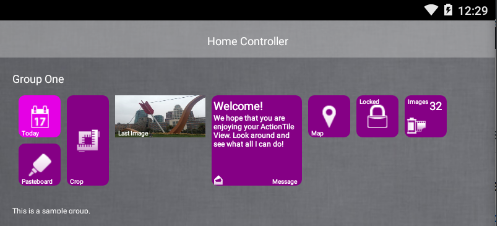

`ACTile` contains the following properties:

* **liveUpdateAction** - Gets or sets the `ACTileLiveUpdate` action that will be performed via an automatic update kicked off by the `liveUpdateTimer` in the parent `ACTileController`.  
* **title** - The optional title of the tile.
* **subtitle** - The optional subtitle of the tile.
* **description** - The optional description of the tile.
* **icon** - The optional icon/image for the tile.
* **appearance** - The tile's appearance such as font sizes and colors.
* **style** - The type of tile that will be displayed.
* **group** - The `ACTileGroup` that the tile belongs to.
* **tileSize** - The size of the tile.
* **customRowHeight** - Defines the number of rows a column occupies when the `size` is set to `custom`.
* **customColumnHeight** - Defines the number of columns a column occupies when the `size` is set to `custom`.

`ACTiles` are created by the `AddTile` method of the `ACTileGroup`.

## ACTileAppearance

Defines the customizable properties of an `ACTile` that control it's look and feel such as:

* **autoSetTextColor** - If `true` the tile will automatically select all the text colors to contrast the tile's background color.
* **background** - The tile's background color.
* **border** - The tile's border color.
* **borderWidth** - The width of the tile's border.
* **borderRadius** - The radius of the tile's rounded corners.
* **roundTopLeftCorner** - Rounds the tile's top left corner.
* **roundTopRightCorner** - Rounds the tile's top right corner.
* **roundBottomLeftCorner** - Rounds the tile's bottom left corner.
* **roundBottomRightCorner** - Rounds the tile's bottom right corner.
* **isRoundRect** - `true` if all corners are rounded.
* **isRect** - `true` if none of the corners are rounded.
* **shadow** - The tile's shadow color.
* **hasShadow** - `true` if the tile display's a shadow.
* **titleColor** - The title color for the tile.
* **titleSize** - The title font size.
* **subtitleColor** - The subtitle color for the tile.
* **subtitleSize** - The subtitle font size.
* **titleBackground** - The background color for the tile's title.
* **descriptionColor** - The tile's description color.
* **descriptionSize** - The description font size.

## ACTileController

Creates, maintains and controls a scrollable collection of `ACTile` object that can be organized into `ACTileGroups`. Provides routines to automatically "live update" the contents or styling of the tiles and routines to handle user interaction with the tile selection.

The `ACTileController` has the following properties:

* **groups** - The collection of `ACTileGroups` that the controller maintains.
* **liveUpdateAction** - Gets or sets the `ACTileLiveUpdate` action that will be performed via an automatic update kicked off by the `liveUpdateTimer` in the parent `ACTileController`.
* **liveUpdateRunning** - `true` is a live update is currently being performed.
* **setScrollDirectionFromDeviceOrientation** - If `true` the Tile Controller will attempt to set the scroll direction based on the devices orientation.
* **suspendUpdates** - If `true` all updates will be suspended until set to `false`. Set `suspendUpdates` to `true` when performing a large number of tile updates or additions to improve app performance.
* **navigationBar** - Provides access to the Tile Controller's `ACTileNavigationBar`.
* **liveUpdate** - If `true` the Tile Controller will run any live updates attached to any given Tile, Group or the Controller itself.
* **liveUpdateFrequency** - Set the number of seconds between live updates.
* **groupAppearance** - Sets the default appearance for all Groups.
* **tileAppearance** - Sets the default appearance for all Tiles in all Groups.
* **scrollDirection** - Sets the scroll direction.
* **appearance** - Controls the appearance of the Tile Controller.
* **scrollView** - Provides access to the embedded scroll view.
* **title** - Sets the title for the Tile Controller.
* **count** - Returns the number of Groups being controlled by this Tile Controller.

Use the `AddGroup` method to add a new group to the Tile Controller's collection. For example:

```csharp
// Add new group
var scenes = tileController.AddGroup(ACTileGroupType.ExpandingGroup, "Favorite Scenes", "");
```

## ACTileControllerAppearance

Defines the customizable properties of an `ACTileController` that control it's look and feel:

* **cellSize** - Defines the size of each cell in pixels. Even though tiles can be all different shapes and sizes, the default unit of measure is a square cell of which all tile sizes are then calculated.
* **cellGap** - The space between the cells.
* **groupGap** - The space between the groups.
* **background** - The Tile Controller's background color.
* **backgroundImage** - The optional Tile Controller background image.
* **border** - The Tile Controller's border color.
* **indentTop** - The top indention.
* **indentBottom** - The bottom indention.
* **indentLeft** - The left indention.
* **indentRight** - The right indention.

The `cellSize` and `cellGap` properties control the physical size of each Tile based on a virtual Cell Grid. So a Default tile size could be represented as:

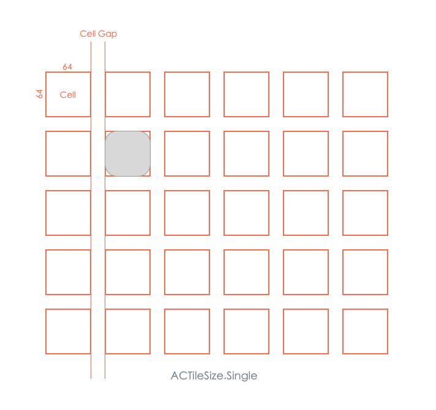

## ACTileControllerScrollDirection

Controls the direction that `UIActionTileGroups` will be scrolled inside their parent `UIActionTileController`:


* **Horizontal** - The Group/Tile collection will be laid out top to bottom and scroll left and right.
* **Vertical** - The Group/Tile collection will be laid out left to right and scroll up and down.


## ACTileGroup

Maintains a collection of `ACTile` objects that are contained within a `ACTileController`. The `ACTileGroup` handles the creation and layout of the `ACTile` objects and can control a collection of different sized and shaped tiles:

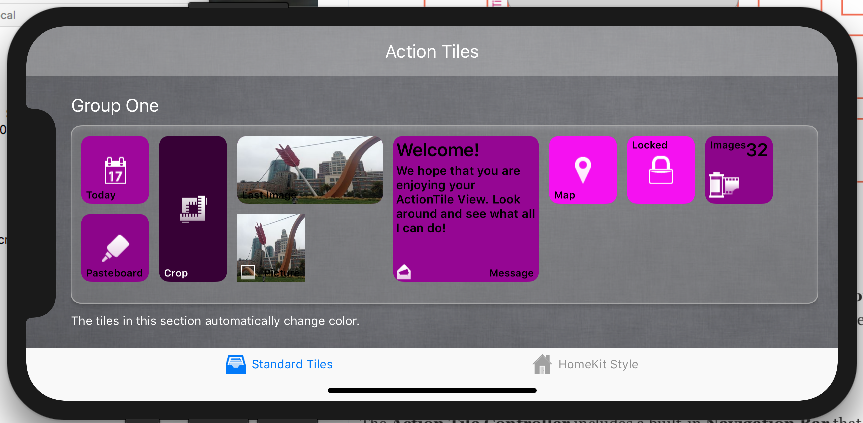

The <c>ACTileGroup</c> has the following properties:

* **defaultTileAppearance** - The default appearance for all Tiles in the Group.
* **liveUpdateAction** - Gets or sets the `ACTileLiveUpdate` action that will be performed via an automatic update kicked off by the `liveUpdateTimer` in the parent `ACTileController`.
* **groupType** - The type of the Group.
* **shrinkTilesToFit** - If `true` larger tiles will be shrunk to the `Single` tile size to fit the next available space when laying out Tiles.
* **autoFitTiles** - If `true` Tiles will be shuffled to fit the next available space regardless of their actual order.
* **controller** - The parent Tile Controller.
* **appearance** - The appearance of the Tile Group.
* **columnConstraint** - Constrains the number of columns in the Group.
* **rowConstraint** - Constrains the number of rows in the Group.
* **title** - The optional Group title.
* **footer** - The optional Group footer.
* **count** - The number of Tiles in the group.

Use the `AddTile` method to add a new Tile to the Group. For example:

```csharp
// Add a default tile size
accessories.AddTile(ACTileStyle.Accessory, ACTileSize.Quad, "Kitchen Eve Door", "No Response", "", "Home");

// Add a custom tile size
scenes.AddCustomSizedTile(1, 4, ACTileStyle.Scene, "Evening", "", "", "Home");
```

## ACTileGroupAppearance

Defines the customizable properties of an `ACTileGroup` that control it's look and feel:

* **hasBackground** - If `true` the Group displays a background, else it is clear.
* **hasShadow** - If `true` the Group has a shadow.
* **background** - The Group's background color.
* **border** - The Group's border color.
* **borderWidth** - The Group's border width.
* **borderRadius** - The radius of the Group's corners.
* **roundTopLeftCorner** - Rounds the Group's top left corner.
* **roundTopRightCorner** - Rounds the Group's top right corner.
* **roundBottomLeftCorner** - Rounds the Group's bottom left corner.
* **roundBottomRightCorner** - Rounds the Group's bottom right corner.
* **isRoundRect** - `true` if all corners are rounded.
* **isRect** - `true` if none of the corners are rounded. 
* **shadow** - The Group's shadow color.
* **titleColor** - The title color.
* **titleSize** - The title font size.
* **footerColor** - The footer color.
* **footerSize** - The footer font size.

## ACTileGroupCellConstraint

Controls the number of `rows` or `columns` that will appear inside a given `ACTileGroup`:

* **constraintType** - Sets the type of constraint to apply.
* **maximum** - Sets the maximum number of rows or columns.

## ACTileGroupCellConstraintType

Defines how the `rows` and `columns` inside a `ACTileGroup` will grow based on the number of the contained `ACTiles` and the size of the parent `ACTileController` that holds the controller:

* **Flexible** - Calculated from the number of `rows` or `columns` that have been specified.
* **Fixed** - A set number of `rows` or `columns`.
* **FitParent** - Fills the parent `ACTileController` based on the given indent padding values.

## ACTileGroupType

Defines the type of a `ACTileGroup` based on the `ACTileControllerScrollDirection` and the size of the `ACTileController` that is hosting the group:

* **ExpandingGroup** - For `Horizontal` `ACTileControllerScrollDirection` the `ACTileGroup` will fill the parent `ACTileController` vertically and grow in width based on the number of `ACTiles` it contains. For Vertical this is inverted, it will fill the parent ACTileController horizontally and grow vertically.
* **PageGroup** - The `ACTileGroup` will be one "page" wide and high, filling the parent `ACTileController` both horizontally and vertically.
* **FixedSizePageGroup** - For `Horizontal` `ACTileControllerScrollDirection` the `ACTileGroup` will fill the parent `ACTileController` horizontally and have a fixed height based on the given number of rows. For `Vertical` this is inverted, it will fill the parent `ACTileController` vertically and have a fixed width based on the given number of columns.

## ACTileNavigationBar

Handles the Navigation Bar that can be shown at the top of a `ACTileController`. The developer can include `Buttons` on the left and right hand sides of the bar:


The `ACTileNavigationBar` has the following properties:

* **leftButtons** - The collection of buttons displayed on the left side of the bar.
* **rightButtons** - The collection of buttons displayed on the right side of the bar.
* **appearance** - The bar's appearance.
* **title** - The bar's title.
* **hidden** - `true` if the Navigation Bar is hidden.

Use the `ShowNavigationBar` method to display the Navigation Bar and the `HideNavigationBar` method to hide it. For example:

```csharp
// Show the bar
tileController.ShowNavigationBar(true);
...

// Hide the bar
tileController.HideNavigationBar(true);
```

The default is for the Navigation Bar to be hidden.

## ACTileNavigationBarAppearance

Defines the customizable properties of an `ACTileNavigationBar` that control it's look and feel:

* **background** - The default background color.
* **darkBackground** - The darkened background color.
* **autoDarkenBackground** - If `true`, the Navigation Bar will automatically switch to the `darkBackground` when a Tile Group scrolls under it and return to the `background` color when it scrolls out.
* **titleColor** - The color of the title.
* **titleSize** - The title font size.
* **barHeight** - The height of the Navigation Bar.
* **topPadding** - The optional padding to add to the top of the bar.

## ACTileSize

Defines the number of `cells` required to display a given `ACTile` within it's parent `ACTileGroup`. A `cell` is the unit of measure with the "virtual layout grid" that `ACTile` are laid out in:

### Single

A single `cell` is required to display the given `ACTile`:


### DoubleHorizontal

Two horizontal `cells` are required to display the given `ACTile`:

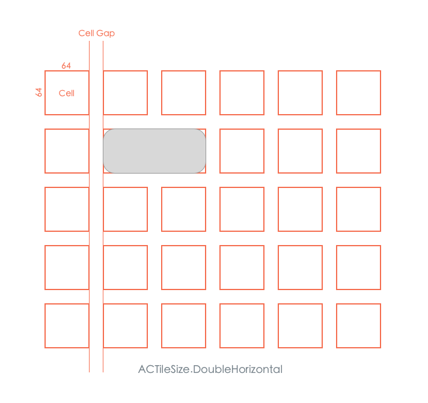


### QuadHorizontal

Four horizontal `cells` are required to display the given `ACTile`:

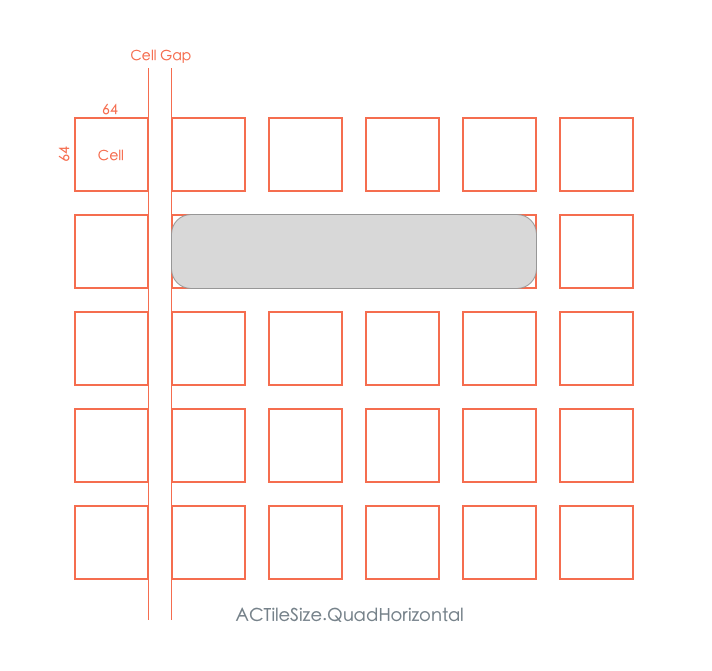

### DoubleVertical

Two vertical `cells` are required to display the given `ACTile`:

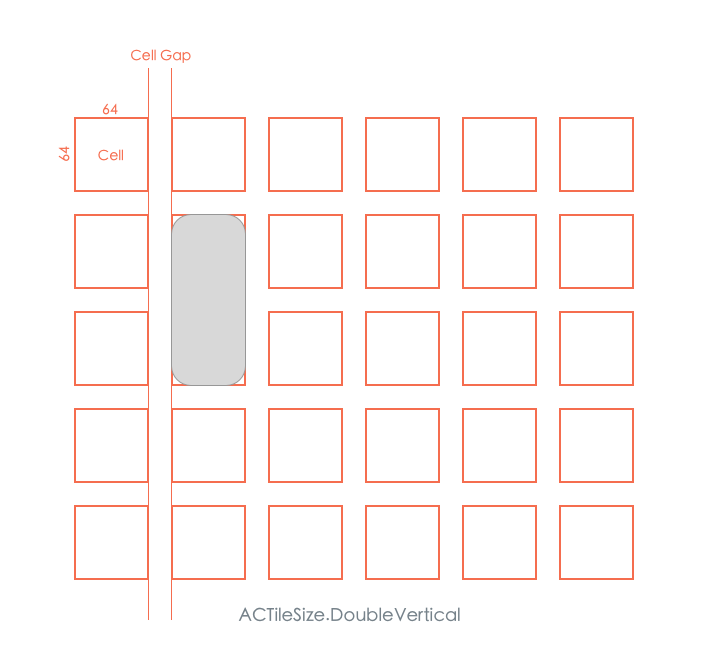

### Quad

Four `cells`, two horizontal and two vertical, are required to display the given `ACTile`:

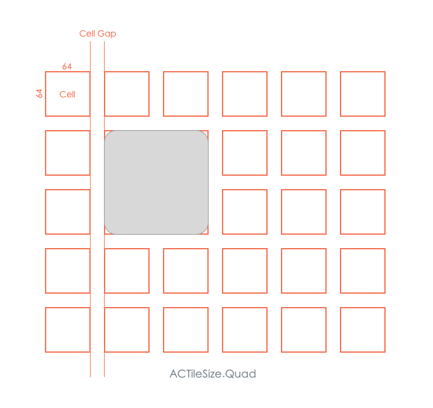

### Custom

Allows the developer to customize the tile size in horizontal and vertical `cells` used:


## ACTileStyle

Defines the style of a `ACTile` and controls what information it will display and how that information will be rendered:

* **Default** - A `ACTile` with a large central icon and optional title on the bottom.
* **DescriptionBlock** - A `ACTile` with a central block of text, and optional title and an optional title image.
* **CornerIcon** - A `ACTile` with an icon 32 x 32 pixel icon in the lower left hand corner and an optional title.
* **TopTitle** - A `ACTile` with a large central icon and optional title on the top line.
* **BigPicture** - A `ACTile` with a large image and optional title on the bottom.
* **Scene** - A `ACTile` with a large image and optional title. This style works best with a `ACTileSize` of `DoubleHorizontal` or greater.
* **Accessory** - A `ACTile` with a large image in the upper left hand corner and optional title and subtitle at the bottom. This style works best with a `ACTileSize` of `Quad`.
* **CustomDraw** - Allows the developer to custom draw the `ACTile`.

When the `CustomDraw` style is selected, use the `RequestCustomDraw` **Tile** event to handle the drawing process:

```csharp
// Create a custom drawn tile in this group
var customTile = group1.AddTile(ACTileStyle.CustomDrawn, ACTileSize.Single, "Picture", "", "", "Polaroid");

// Respond to the draw event
customTile.RequestCustomDraw += (tile, rect) => {

	//Fill with an image
	UIImage image = UIImage.FromBundle("Arrow.jpg");
	image.Draw(rect);

	//Request a standard bottom title bar be drawn
	tile.DrawBottomTitleBar(rect, true);
};
```

## ACTileLiveUpdate

Works with the `liveUpdateAction` property of an `ACTile`, `ACTileGroup` or `ACTileController` to automatically update the look of information on one or more tiles based on a given time interval. For example:

```csharp
// Assign a live update action to this group
favorites.liveUpdateAction = new ACTileLiveUpdateGroupChromaKey(favorites, ACColor.Purple, 50, 250);
```

The following types of live update are available:

### ACTileLiveUpdateControllerChromaKey

Mutates the color of the given `ACTile` attached to this `ACTileLiveUpdate` with in the given brightness range for the given base color:

* **background** - Sets the starting background color.
* **minimum** - Gets or sets the minimum hue variance.
* **maximum** - Gets or sets the maximum hue variance.

### ACTileLiveUpdateGroupChromaKey

Causes a random color mutation within a given brightness range off the provided base color for every `ACTile` in the `ACTileGroup` attached to this `ACTileLiveUpdate`:

* **background** - Sets the starting background color.
* **minimum** - Gets or sets the minimum hue variance.
* **maximum** - Gets or sets the maximum hue variance.

### ACTileLiveUpdateGroupColor

Changes the background color of every `ACTile` in the `ACTileGroup` attached to this `ACTileLiveUpdate` action to one of the colors listed in sequence:

* **colors[]** - An array of colors to pick from.

### ACTileLiveUpdateGroupColorRandom

Changes the background color of every `ACTile` in the `ACTileGroup` attached to this `ACTileLiveUpdate` action to one of the colors listed in sequence:

* **colors[]** - An array of colors to pick from.

### ACTileLiveUpdateTileChromaKey

Mutates the color of the given `ACTile` attached to this `ACTileLiveUpdate` with in the given brightness range for the given base color.

* **background** - Sets the starting background color.
* **minimum** - Gets or sets the minimum hue variance.
* **maximum** - Gets or sets the maximum hue variance.

### ACTileLiveUpdateTileColor

Changes the background color of the `ACTile` attached to this `ACTileLiveUpdate` action to one of the colors listed in sequence:

* **colors[]** - An array of colors to pick from.

### ACTileLiveUpdateTileImages

Mutates the image of a selected `ACTile` by cycling through a list of provided images:

* **filenames[]** (iOS ONLY) - A list of filenames for the images to cycle through.
* **images[]** - A collection of images to cycle through.

**NOTE**: On iOS, the developer can provide _either_ a list of filenames or a collection of images, but should not provide both.

### ACTileLiveUpdateTileSequence

Runs a sequence of `ACTileLiveUpdate` actions against the given `ACTile`:

* **liveUpdateActions[]** - A collection of `liveUpdates` to run against the tile.

### ACTileLiveUpdateTileText

Changes the title, subtitle and description for the given `ACTile`:

* **titles[]** - A collection of titles to cycle through.
* **subtitles[]** - A collection of subtitles to cycle through.
* **descriptions[]** - A collection of descriptions to cycle through.

**NOTE**: The developer should provide an equal number of `titles`, `subtitles` and `descriptions`.

# iOS Example

The following is an example of work with a **Action Tiles** controller added to the `main.storyboard` file of an iOS app:

```csharp
// Setup tile controller
tileController.title = "Action Tiles";
tileController.scrollDirection = ACTileControllerScrollDirection.Vertical;
tileController.appearance.backgroundImage = UIImage.FromBundle("Linen.jpg");
tileController.navigationBar.ShowNavigationBar(true);

// Set default group appearances
tileController.groupAppearance.roundTopLeftCorner = false;
tileController.groupAppearance.roundTopRightCorner = false;
tileController.groupAppearance.roundBottomLeftCorner = false;
tileController.groupAppearance.roundBottomRightCorner = false;

// Set default tile appearances
tileController.tileAppearance.roundTopLeftCorner = false;
tileController.tileAppearance.roundTopRightCorner = false;
tileController.tileAppearance.roundBottomLeftCorner = false;
tileController.tileAppearance.roundBottomRightCorner = false;

// Suspend updates
tileController.suspendUpdates = true;

// Add new group
var group1 = tileController.AddGroup(ACTileGroupType.ExpandingGroup, "Group One", "The tiles in this section automatically change color.");
group1.appearance.hasBackground = false;
group1.autoFitTiles = true;

group1.AddTile(ACTileStyle.Default, ACTileSize.Single, "Today", "", "", "CalendarDay");
group1.AddTile(ACTileStyle.Default, ACTileSize.DoubleVertical, "Crop", "", "", "Crop");
group1.AddTile(ACTileStyle.BigPicture, ACTileSize.DoubleHorizontal, "Last Image", "", "", "Arrow.jpg").appearance.titleColor = ACColor.White;
group1.AddTile(ACTileStyle.DescriptionBlock, ACTileSize.Quad, "Message", "Welcome!", "We hope that you are enjoying your ActionTile View. Look around and see what all I can do!", "OpenMail");
group1.AddTile(ACTileStyle.Default, ACTileSize.Single, "Map", "", "", "Marker");
group1.AddTile(ACTileStyle.TopTitle, ACTileSize.Single, "Locked", "", "", "Lock");
group1.AddTile(ACTileStyle.CornerIcon, ACTileSize.Single, "Images", "32", "", "FilmRoll");
group1.AddTile(ACTileStyle.Default, ACTileSize.Single, "Pasteboard", "", "", "PasteBoard");

// Create a custom drawn tile in this group
var customTile = group1.AddTile(ACTileStyle.CustomDrawn, ACTileSize.Single, "Picture", "", "", "Polaroid");

// Respond to the draw event
customTile.RequestCustomDraw += (tile, rect) => {

	//Fill with an image
	UIImage image = UIImage.FromBundle("Arrow.jpg");
	image.Draw(rect);

	//Request a standard bottom title bar be drawn
	tile.DrawBottomTitleBar(rect, true);
};

// Randomily assign a purple color to the tiles in this group with the
// given brightness range
group1.ChromaKeyTiles(ACColor.Purple, 50, 250);

// Assign a live update action to this group
group1.liveUpdateAction = new ACTileLiveUpdateGroupChromaKey(group1, ACColor.Purple, 50, 250);

// Add and configure the second group
var group2 = tileController.AddGroup(ACTileGroupType.ExpandingGroup, "Group Two", "This group includes several live update features.");
group2.appearance.hasBackground = false;
group2.autoFitTiles = true;

// Add tiles to second group
var photos = group2.AddTile(ACTileStyle.Default, ACTileSize.Quad, "Photos", "", "", "ManWithChild.jpg");
group2.AddTile(ACTileStyle.CornerIcon, ACTileSize.DoubleHorizontal, "Flight Arrives", "2:00pm", "", "Airplane");
group2.AddTile(ACTileStyle.CornerIcon, ACTileSize.Single, "Cards", "", "", "ATMCard");
group2.AddTile(ACTileStyle.Default, ACTileSize.DoubleVertical, "Briefcase", "", "", "Briefcase");
var wakeup = group2.AddTile(ACTileStyle.Default, ACTileSize.DoubleHorizontal, "Wake-up", "6:30am", "", "Brightness");
group2.AddTile(ACTileStyle.Default, ACTileSize.Single, "This Month", "", "", "CalendarMonth");
var chat = group2.AddTile(ACTileStyle.Default, ACTileSize.Single, "Chat", "4", "", "Chat");
var mail = group2.AddTile(ACTileStyle.Default, ACTileSize.DoubleHorizontal, "New Messages", "12", "", "ClosedMail");
group2.AddTile(ACTileStyle.Default, ACTileSize.Single, "Portfolio", "", "", "Portfolio");
group2.AddTile(ACTileStyle.Default, ACTileSize.DoubleVertical, "Files", "142", "", "Folder");
group2.AddTile(ACTileStyle.Default, ACTileSize.DoubleHorizontal, "System Settings", "", "", "Gear");
group2.AddTile(ACTileStyle.BigPicture, ACTileSize.Quad, "The Bay Bridge", "", "", "Bridge.jpg");
group2.AddTile(ACTileStyle.Default, ACTileSize.Single, "Encrypt", "", "", "Key");
group2.AddTile(ACTileStyle.BigPicture, ACTileSize.Single, "News", "", "", "Fountain.jpg");
var systemState = group2.AddTile(ACTileStyle.DescriptionBlock, ACTileSize.Quad, "Links", "System Offline", "No remote links are currently active on this device. Tap tile to update...", "Link");
group2.AddTile(ACTileStyle.Default, ACTileSize.Single, "You are here", "", "", "Marker");
group2.AddTile(ACTileStyle.Default, ACTileSize.Single, "Recording", "", "", "Microphone");

// Attach live update events to group 2 tiles
photos.liveUpdateAction = new ACTileLiveUpdateTileImages(photos, new string[] {
	"Arrow.jpg",
	"Boat.jpg",
	"Bridge.jpg",
	"Fountain.jpg",
	"ManWithChild.jpg"
});
mail.liveUpdateAction = new ACTileLiveUpdateTileImages(mail, new string[] { "OpenMail", "ClosedMail" });
wakeup.liveUpdateAction = new ACTileLiveUpdateTileColor(wakeup, new ACColor[] {
	ACColor.Red,
	ACColor.ActionYellowOrange
});

group2.liveUpdateAction = new ACTileLiveUpdateGroupColorRandom(group2, new ACColor[] {
	ACColor.ActionBrightOrange,
	ACColor.ActionRedOrange,
	ACColor.Red,
	ACColor.ActionBrickRed
});

// Add multiple live updates to a given tile
var sequence = new ACTileLiveUpdateTileSequence(systemState);
sequence.Add(new ACTileLiveUpdateTileText(systemState, new string[] { "System Test", "System Offline" }, new string[] {
	"Testing...",
	"Links"
}, new string[] {
	"Runing connectivity tests on device. Please standby...",
	"No remote links are currently active on this device. Tap tile to update..."
}));
sequence.Add(new ACTileLiveUpdateTileChromaKey(systemState, ACColor.Purple, 100, 250));

systemState.liveUpdateAction = sequence;

// Add and configure the third group
var group3 = tileController.AddGroup(ACTileGroupType.ExpandingGroup, "Group Three", "");
group3.autoFitTiles = true;

// Add tiles to third group
group3.AddTile(ACTileStyle.Default, ACTileSize.Quad, "Airplane Mode", "OFF", "", "Airplane");
group3.AddTile(ACTileStyle.Default, ACTileSize.DoubleVertical, "Let's Chat", "", "", "Chat");
var cloud = group3.AddTile(ACTileStyle.DescriptionBlock, ACTileSize.DoubleHorizontal, "Cloud", "", "There are 2 new files in your shared cloud", "Cloud");
group3.AddTile(ACTileStyle.Default, ACTileSize.Quad, "On The Air", "", "", "RadioTower");
group3.AddTile(ACTileStyle.Default, ACTileSize.Single, "Tags", "", "", "Tag");
group3.AddTile(ACTileStyle.Default, ACTileSize.Single, "Wallet", "", "", "Wallet");
group3.AddTile(ACTileStyle.Default, ACTileSize.DoubleVertical, "TV", "", "", "TV");
group3.AddTile(ACTileStyle.Default, ACTileSize.Single, "Movies", "", "", "Movie");
group3.AddTile(ACTileStyle.Default, ACTileSize.Single, "Microphone", "", "", "Microphone");
group3.AddTile(iOSDevice.isPhone ? ACTileStyle.CornerIcon : ACTileStyle.Default, ACTileSize.Quad, iOSDevice.isPhone ? "" : "Current Time", iOSDevice.isPhone ? "12:30" : "12:30pm", "", "Clock");
group3.AddTile(ACTileStyle.Default, ACTileSize.DoubleHorizontal, "Contrast", "", "", "Contrast");
group3.AddTile(ACTileStyle.Default, ACTileSize.DoubleHorizontal, "System Check-Up", "", "", "CheckMark");
group3.AddTile(ACTileStyle.Default, ACTileSize.DoubleHorizontal, "This Week", "", "", "CalendarWeek");
var pictureStream = group3.AddTile(ACTileStyle.BigPicture, ACTileSize.Quad, iOSDevice.isPhone ? "" : "PictureStream", "42", "", "Boat.jpg");
group3.AddTile(ACTileStyle.Default, ACTileSize.Single, "Key", "", "", "Key");
group3.AddTile(ACTileStyle.Default, iOSDevice.isPhone ? ACTileSize.DoubleHorizontal : ACTileSize.DoubleVertical, "Music", "", "", "Music");

// Add live updates to group
pictureStream.liveUpdateAction = new ACTileLiveUpdateTileImages(pictureStream, new string[] { "ManWithChild.jpg", "Bridge.jpg", "Arrow.jpg", "Fountain.jpg", "Boat.jpg" });
group3.liveUpdateAction = new ACTileLiveUpdateGroupColor(group3, new ACColor[] {
	ACColor.ActionBrickRed,
	ACColor.ActionCyan,
	ACColor.ActionDustyRose,
	ACColor.ActionGrape,
	ACColor.ActionGreenTea,
	ACColor.ActionLavendar,
	ACColor.ActionNavyBlue,
	ACColor.ActionOrange,
	ACColor.ActionPink,
	ACColor.ActionPinkGrapefruit,
	ACColor.ActionRedOrange,
	ACColor.ActionSkyBlue,
	ACColor.ActionTeal,
	ACColor.ActionYellow,
	ACColor.ActionYellowGreen,
	ACColor.ActionYellowOrange
});

// Randomily assign a green color to the tiles in this group with the
// given brightness range
group3.ChromaKeyTiles(ACColor.ActionYellowGreen, 50, 250);

// Add and configure the fourth group
var group4 = tileController.AddGroup(ACTileGroupType.ExpandingGroup, "Group Four", "");
group4.autoFitTiles = true;

// Add tiles to fourth group
group4.AddTile(ACTileStyle.Default, ACTileSize.Single, "Monitor", "", "", "Widescreen");
group4.AddTile(ACTileStyle.Default, ACTileSize.DoubleVertical, "Desktop", "", "", "Arrow.jpg");
group4.AddTile(ACTileStyle.DescriptionBlock, ACTileSize.DoubleHorizontal, "System Tools", "", "It's been 4 days since your last scan.", "Tools");
group4.AddTile(ACTileStyle.BigPicture, ACTileSize.Quad, "Feeds", "15", "", "Fountain.jpg");
group4.AddTile(ACTileStyle.Default, ACTileSize.Single, "locate", "", "", "Scanner");
group4.AddTile(ACTileStyle.BigPicture, ACTileSize.Single, "", "", "", "Boat.jpg");
group4.AddTile(ACTileStyle.Default, ACTileSize.Single, "Radio", "", "", "Radio");
group4.AddTile(ACTileStyle.Default, ACTileSize.Single, "Labels", "", "", "Tag");
group4.AddTile(ACTileStyle.Default, ACTileSize.Single, "Password", "", "", "Key");

// Randomily assign a green color to the tiles in this group with the
// given brightness range
group4.ChromaKeyTiles(ACColor.ActionSkyBlue, 50, 250);

// Restore updates
tileController.suspendUpdates = false;

// Tell the controller to automatically update itself
tileController.liveUpdate = true;

// Display touched tile
tileController.TileTouched += (group, tile) => {
	Console.WriteLine("Touched tile {0} in group {1}", tile.title, group.title);
};
```

Produces the following output:

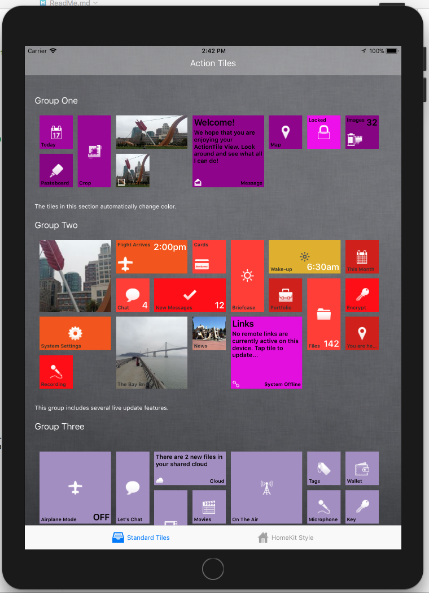

# Android Examples

The following is an example of work with the individual **Action Color Picker** components added to the `main.axml` file of an Android app:

```csharp
using ActionComponents;
using UIKit;
...

// Configure tiles
var tileController = FindViewById<ACTileController>(Resource.Id.tileController);
tileController.title = "Home Controller";
tileController.navigationBar.ShowNavigationBar(true);
tileController.scrollDirection = ACTileControllerScrollDirection.Vertical;

// Stop the tile controller from updating while we populate it
tileController.suspendUpdates = true;

// Display as HomeKit style
tileController.appearance.backgroundImage = UIImage.FromResources(Resources, Resource.Drawable.Agreement);

// Style tiles
var sceneSize = 4;
tileController.appearance.cellSize = 50f;
tileController.tileAppearance.titleSize = 14f;
tileController.tileAppearance.subtitleColor = ACColor.FromRGB(100, 100, 100);
tileController.tileAppearance.subtitleSize = 12f;

// Add new group
var scenes = tileController.AddGroup(ACTileGroupType.ExpandingGroup, "Favorite Scenes", "");

scenes.AddCustomSizedTile(1, sceneSize, ACTileStyle.Scene, "Evening", "", "", Resources, Resource.Drawable.House);
scenes.AddCustomSizedTile(1, sceneSize, ACTileStyle.Scene, "Go to Bed", "", "", Resources, Resource.Drawable.House);
scenes.AddCustomSizedTile(1, sceneSize, ACTileStyle.Scene, "Night", "", "", Resources, Resource.Drawable.House);
scenes.AddCustomSizedTile(1, sceneSize, ACTileStyle.Scene, "Start Work", "", "", Resources, Resource.Drawable.House);
scenes.AddCustomSizedTile(1, sceneSize, ACTileStyle.Scene, "Sunset", "", "", Resources, Resource.Drawable.House);
scenes.AddCustomSizedTile(1, sceneSize, ACTileStyle.Scene, "Wake Up", "", "", Resources, Resource.Drawable.House);

// Add new group
var accessories = tileController.AddGroup(ACTileGroupType.ExpandingGroup, "Favorite Accessories", "");

accessories.AddTile(ACTileStyle.Accessory, ACTileSize.Quad, "Kitchen Eve Door", "No Response", "", Resources, Resource.Drawable.House);
accessories.AddTile(ACTileStyle.Accessory, ACTileSize.Quad, "Patio Eve Humidity", "No Response", "", Resources, Resource.Drawable.House);
accessories.AddTile(ACTileStyle.Accessory, ACTileSize.Quad, "Patio Eve Temp", "No Response", "", Resources, Resource.Drawable.House);
accessories.AddTile(ACTileStyle.Accessory, ACTileSize.Quad, "Bedroom", "Off", "", Resources, Resource.Drawable.LightOff);
accessories.AddTile(ACTileStyle.Accessory, ACTileSize.Quad, "Dining Room Left", "Off", "", Resources, Resource.Drawable.LightOff);
accessories.AddTile(ACTileStyle.Accessory, ACTileSize.Quad, "Dining Room Right", "Off", "", Resources, Resource.Drawable.LightOff);
accessories.AddTile(ACTileStyle.Accessory, ACTileSize.Quad, "Living Bloom", "Off", "", Resources, Resource.Drawable.LightOff);
accessories.AddTile(ACTileStyle.Accessory, ACTileSize.Quad, "Living Iris", "Off", "", Resources, Resource.Drawable.LightOff);
accessories.AddTile(ACTileStyle.Accessory, ACTileSize.Quad, "Living Lightstrip", "Off", "", Resources, Resource.Drawable.LightOff);
accessories.AddTile(ACTileStyle.Accessory, ACTileSize.Quad, "Living Table Lamp", "Off", "", Resources, Resource.Drawable.LightOff);
accessories.AddTile(ACTileStyle.Accessory, ACTileSize.Quad, "Living Wicker Bottom", "Off", "", Resources, Resource.Drawable.LightOff);
accessories.AddTile(ACTileStyle.Accessory, ACTileSize.Quad, "Living Wicker Top", "Off", "", Resources, Resource.Drawable.LightOff);
accessories.AddTile(ACTileStyle.Accessory, ACTileSize.Quad, "Office Desk", "Off", "", Resources, Resource.Drawable.LightOff);
accessories.AddTile(ACTileStyle.Accessory, ACTileSize.Quad, "Office Side Table", "Off", "", Resources, Resource.Drawable.LightOff);

// Wire-up accessories events
accessories.TileTouched += (group, tile) => {
	switch (tile.subtitle)
	{
		case "Off":
			tile.subtitle = "On";
			if (tile.title == "Bedroom")
			{
				// Simulate a light color
				tile.ChromaKeyTile(ACColor.Purple, 50, 250);
			}
			else
			{
				// Just set to white
				tile.appearance.background = ACColor.White;
			}
			tile.icon = UIImage.FromResources(Resources, Resource.Drawable.LightOn);
			break;
		case "On":
			tile.subtitle = "Off";
			tile.appearance.background = ACColor.FromRGBA(213, 213, 213, 240);
			tile.icon = UIImage.FromResources(Resources, Resource.Drawable.LightOff);
			break;
	}
};

// Allow update and automatically refresh the screen
tileController.suspendUpdates = false;

// Display touched tile
tileController.TileTouched += (group, tile) => {
	Console.WriteLine("Touched tile {0} in group {1}", tile.title, group.title);
};
```

Produces the following output:

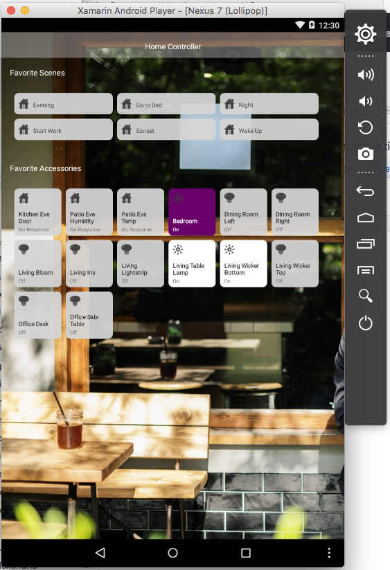

# Trial Version

The Trial version of **Action Tiles** is fully functional but includes a `Toast` style popup. The fully licensed version removes this popup.