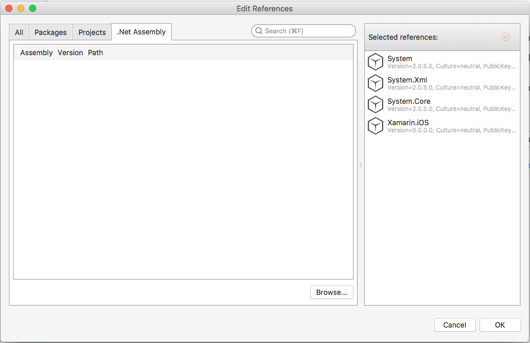

#Action Components Getting Started Guide

## Discover Action Components

Thank you for purchasing our [Action Components](http://appracatappra.com/products/action-components/) suite of User Interface and time-saving tools for the Xamarin Platform and Visual Studio. We hope you enjoy using our components and that they become a valuable part of your developer environment. 

This guide is designed to help you get up and running with the **Action Components** quickly and easily in your own app projects.

The following topics are covered:

* [Adding Action Components to an App Project](#Adding-Action-Components-to-an-App-Project)
* [Activating Your License](#Activating-Your-License)
* [Component Documentation](#Component-Documentation)
* [Frequently Asked Questions](#Frequently-Asked-Questions)
* [Getting Support](#Getting-Support)

<a name="Adding-Action-Components-to-an-App-Project"></a>
## Adding Action Components to an App Project

Our components were designed to be quickly added to your app's project with a minimum of code, making it easy to add high-quality, professional features and functionality to your apps.

In Visual Studio, do the following:

1. Open an app project or start a new one.
2. Double-click the `References` folder:

	
3. Select the **.Net Assemblies** tab from the **Edit References** dialog:

	
4. Click on the **Browse...** button, navigate to the folder where you unzipped the **ActionComponents.zip** file to.
5. Based on the OS being developed for, open either the **iOS** or **Android** subfolder.
6. Select the `ActionComponents.dll` file and click the **Open** button:

	
7. Click the **OK** button to complete the process and close the **Edit References** dialog.

You are now ready to use the **Action Component** suite in your app project. Include the `using ActionComponents;` statement at the top of any class you want use a component from:


<a name="Activating-Your-License"></a>
## Activating Your License

Before your copy of **Action Components** can be successfully used in any of your app projects, it will need to be activated using the [Activate License](http://appracatappra.com/checkout/activate-license/) form on the Appracatappra website. 

The activation process needs to only be done once and will result in an **Activation Key** that you will need to use with the `AppracatappraLicenseManager` built into the **Action Components** suite.

Failure to add your activation information to the `AppracatappraLicenseManager` **before** using any **Action Component** will result in the following Toast popup message being displayed:

> Unlicensed Appracatappra Product

To generate your key, visit [Activate License](http://appracatappra.com/checkout/activate-license/) and fill out the following form:


The Customer and Product Information **must _exactly_** match (all fields are case sensitive) the information provided when the product was purchased. You can get your Customer Information from the purchase receipt that was emailed to you or by visiting our [Customer Profile](http://appracatappra.com/checkout/customer-profile/) page:


You can find the Product Information on the purchase receipt that was emailed to you or by visiting [Purchase History](http://appracatappra.com/checkout/purchase-history/) page:


Click on the **View Details and Downloads** link to view the details of the purchase:


With the form correctly filled in, click the **Activate** button to generate your **Activation Key**:


Copy the **Activation Key** and store it in a safe place, you'll need it for any app project that uses **Action Components**. This key is only generated during product activation and you have a limited number of activations. To check on the number of activations, visit our [License Keys](http://appracatappra.com/checkout/license-keys/) page:


### Adding Your License to an App Project

With your **Activation Key** generated and your product marked as **Active** in the [License Keys](http://appracatappra.com/checkout/license-keys/) page, you'll need to set the License Information in the `AppracatappraLicenseManager` before any calls are made to an Action Component. This is typically done in the `Main` method of the `Main.cs` file before the app starts for iOS. For example:

```csharp
using UIKit;
using ActionComponents;

namespace iOSActionTiles
{
	public class Application
	{
		// This is the main entry point of the application.
		static void Main(string[] args)
		{
			// Set license information BEFORE any components are called to suppress the
			// "Unlicensed Appracatappra Product" Toast popup.
			AppracatappraLicenseManager.FirstName = "Jane";
			AppracatappraLicenseManager.LastName = "Doe";
			AppracatappraLicenseManager.Email = "jane.doe@company.com";
			AppracatappraLicenseManager.LicenseKey = "985b00013352366cda67994a1fe775c9";
			AppracatappraLicenseManager.ActivationKey = "274-822-9945-3345";

			// if you want to use a different Application Delegate class from "AppDelegate"
			// you can specify it here.
			UIApplication.Main(args, null, "AppDelegate");
		}
	}
}
```

Or the `OnCreate` method of the `MainActivity.cs` file for Android:

```csharp
using ActionComponents;
...

[Activity(Label = "ActionComponentExplorer", Theme = "@android:style/Theme.NoTitleBar", MainLauncher = true, Icon = "@mipmap/icon")]
public class MainActivity : Activity
{
	int count = 1;

	protected override void OnCreate(Bundle savedInstanceState)
	{
		base.OnCreate(savedInstanceState);
		
		// Set license information BEFORE any components are called to suppress the
		// "Unlicensed Appracatappra Product" Toast popup.
		AppracatappraLicenseManager.FirstName = "Jane";
		AppracatappraLicenseManager.LastName = "Doe";
		AppracatappraLicenseManager.Email = "jane.doe@company.com";
		AppracatappraLicenseManager.LicenseKey = "985b00013352366cda67994a1fe775c9";
		AppracatappraLicenseManager.ActivationKey = "274-822-9945-3345";
		
		...
	}
}
```

The Customer and Product Information provided to the `AppracatappraLicenseManager` **must _exactly_** match (all fields are case sensitive) the information provided when the product was activated above. 

Failure to add your activation information to the `AppracatappraLicenseManager` (or providing invalid information) will result in the following Toast popup message being displayed:

> Unlicensed Appracatappra Product

If you are having issues activating your product license, please contact [Customer Support](http://appracatappra.com/support/).

<a name="Component-Documentation"></a>
## Component Documentation

The [Action Components Developer Center](http://appracatappra.com/developers/action-components-developer/) was designed to help you get the most out of our developer tools by providing a selection of Articles, Guides, Samples and Quick Start References for each component in the suite.

Additionally, each tool in the **Action Component Suite** has a fully documented API, with comments for every element included:

* [iOS API Documentation](http://appracatappra.com/api/ios/index.html)
* [Android API Documentation](http://appracatappra.com/api/android/index.html)

<a name="Frequently-Asked-Questions"></a>
## Frequently Asked Questions

The following is a list of frequently asked **Action Component** questions:

* **Can I use Action Components on multiple projects?**

	Yes, you are free to use our controls on as many apps as you like. We do not place any restrictions on how many times you can download or use the components, nor do we limit the number of devices that you can install our components on.
* **Are Action Components royalty free?**

	Yes, you are free to use our controls in any app project, even those for your customers if you develop apps for other companies, without royalties.
* **Can I install Action Components on multiple development machines?**

	The short answer is yes, you can install your copy of **Action Components** on as many development machines that you own. That said, **Action Components** are sold on a per developer seat license. If you have multiple developers, each one will need to purchase their own individual copy of the components. Discounts are available on multi-seat purchase, please contact sales for more details.
* **What does a year's subscription to Action Components provide?**

	**Action Components** are sold on a yearly license per developer seat. During your subscription period, you’ll receive any updates or bug fixes released during the year, free of charge. Additionally, you’ll receive any new UI control or time-saving feature added to the **Action Components** suite, again, free of charge, while your subscription is valid.
* **Will my Action Components stop working if I don't renew my license?**

	No, when you purchase a license to use **Action Components**, they are yours to keep forever and you can use them in as many projects as you like, royalty free. Your components will not stop working when your license expires and you will still be able to include them in new projects. However, you will no longer receive any new bug fixes, updates or feature enhancements so an update to iOS, Android, Xamarin or Visual Studio could potentially break compatibility with your component version.

<a name="Getting-Support"></a>
## Getting Support

Have a question about using one of our products, need to report or check on the status of a bug or need help implementing a tool in your app project? 

For faster support, answers to know issues and to get help from other users try the [Appracatappra Support Forums](http://appracatappra.com/community/).

Additionally, you can fill out our [Support Form](http://appracatappra.com/support/) and you’ll hear from a representative typically within one business day.